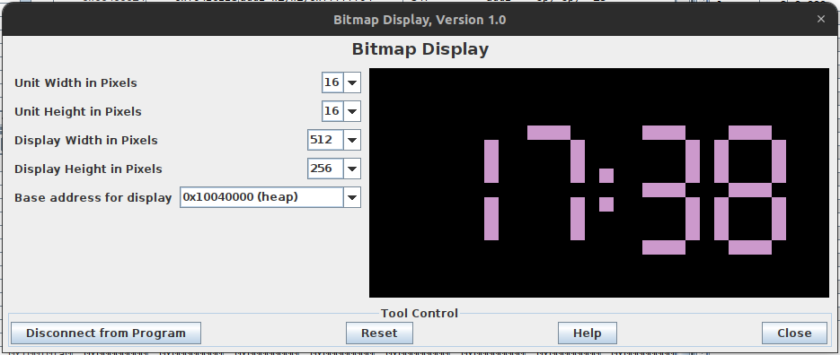

# Animated-clock-in-RISC-V

This project was done during the Computer Science course. It's written in RISC-V assembly (RV32I) using RARS simulator environment.

Program displays an animated clock showing minutes and seconds, starting from a user-defined value. The time is rendered using a simple bitmap font, similar to a 7-segment display. It uses the RARS bitmap display.

## Bitmap display setup

